# Project GC County map to c:geo

In this repository I share all required information to create a .geojson map overlay that can be used in c:geo.

The final result can, for example, look like the image below. In this example, all counties where I have found caches are either yellow or green, counties with T5 caches are green, and counties with no founds are red:  

## Prerequisites
- User account on [geocaching.com ](https://www.geocaching.com/play/search)
- premium membership on [project-gc](https://project-gc.com/)
- Firefox
- python3 (to download the .geojson files)
- Lazarus IDE (if you want to compile the geojson_colorizer application by yourself)
- c:geo installed on a mobile phone

These tools have been successfully tested and run under Linux Mint Mate.

## Features
- Download arbitrary county maps (filtered using project-gc)
- Colorize county maps in any pattern
- Display map overlays in c:geo

## ⚠️ Warning

> ❌ **IMPORTANT:** The "download_mapcounties_geojson.py" script was created using trial-and-error methods (via Claude code). Use it at your own risk and only if you are comfortable giving this script access to your personal data.

## How to

### Setup your pc

Before you can start you have to download all needed data to your pc. To do so you need to
- create a folder on your hard drive to store all files
- store the content of [tools](tools) folder into that folder
- download the geojson_colorizer from the [here](https://github.com/PascalCorpsman/projectgc-county-map-to-cgeo/releases/latest)
- maybe make the .sh file executable (chmod +x Create_geojsonfile.sh)

The final result should look like this:  

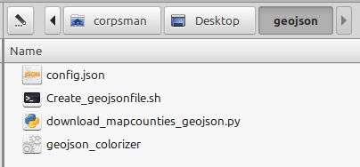

### Download .geojson files

#### Setup the python script

Next, set up the config.json file. Open it in your text editor of choice and enter your "profilename" and "country". Here's an example:  

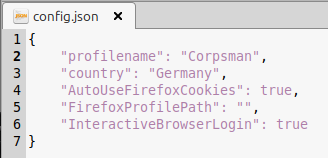

#### Run the script and download a .geojson file

Open a console in your folder and run the .sh script:  

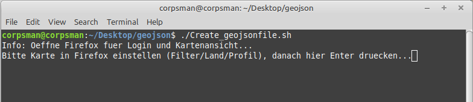

Firefox will open and ask you to log in and authenticate (this step is skipped if you're already logged in). Enter all required information until you reach this page:  

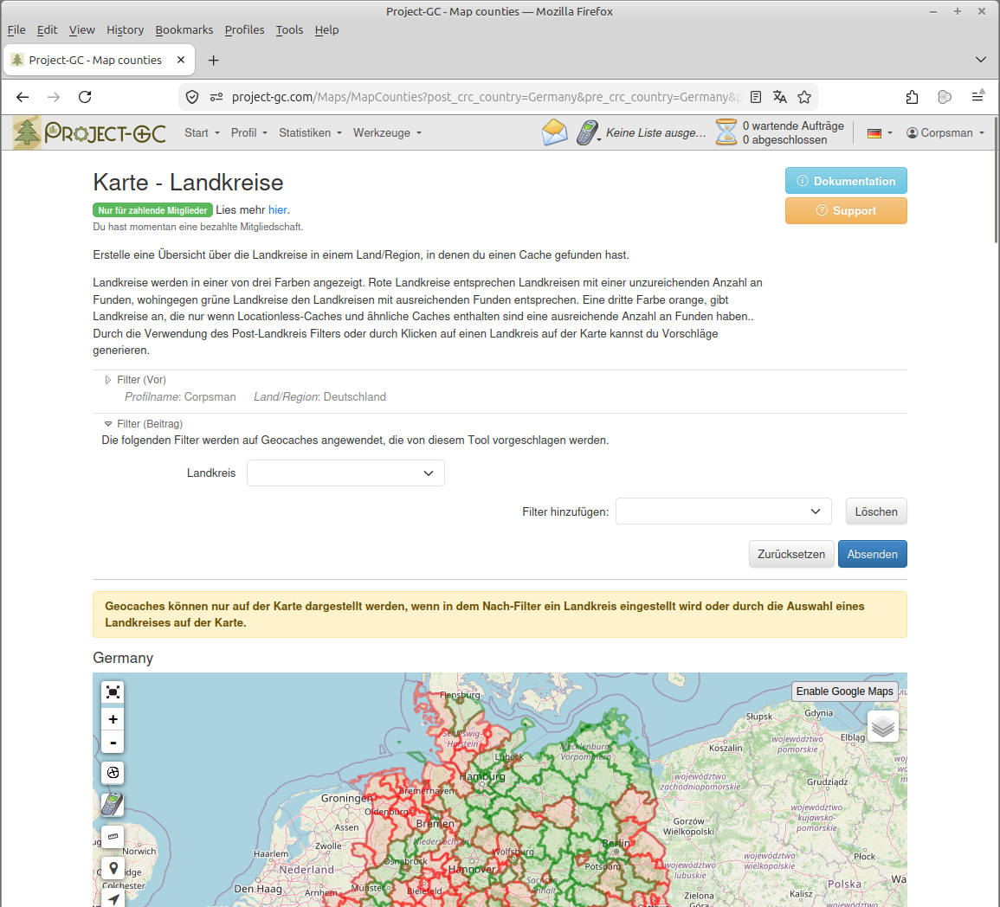

Set all filters you need and let project GC process the results. Then press Enter in the console window.

Copy and paste the URL from Firefox into the console window:  

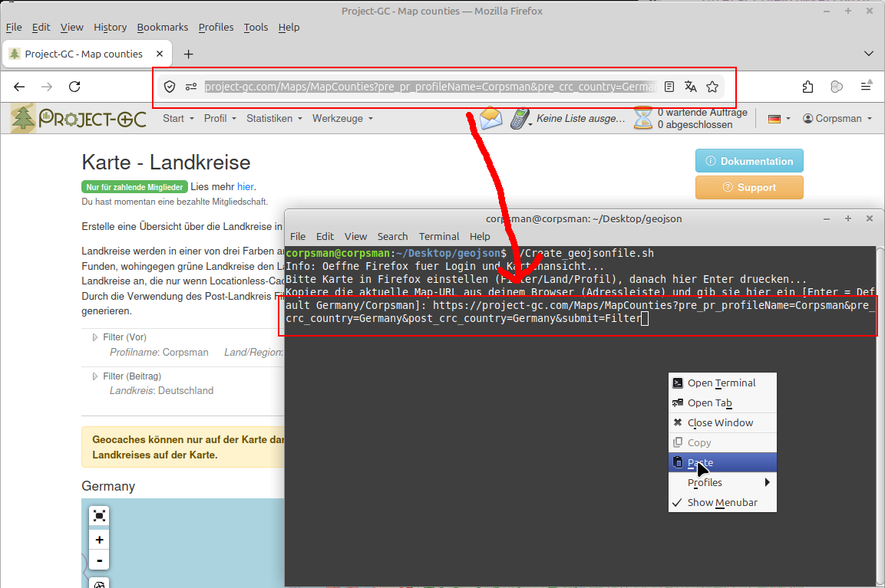

Press Enter and wait for the filename prompt:  

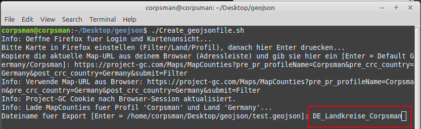

Press Enter and wait until the file is saved to your hard drive:  

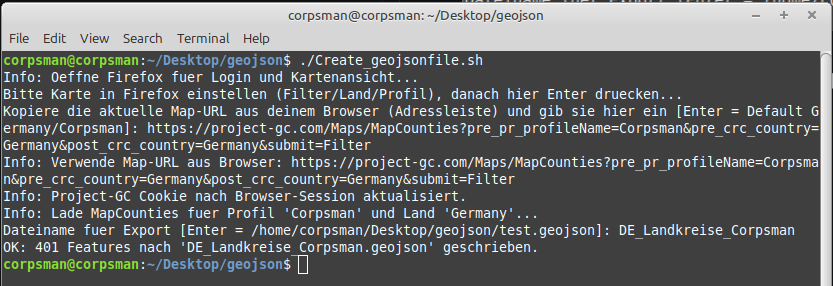

ℹ️ Repeat this step for each map variant you want to create.

> **Note:** If you only want a "simple" colorized county map, you can skip the next section and jump directly to [Add the .geojson file into c:geo](#add-the-geojson-file-into-cgeo)

### Use the geojson colorizer for more colors

By default, the extracted .geojson files are colored in red and green. However, you can change this using the geojson_colorizer application to add any arbitrary color to any county.

During creation of the extract geojson script, the following colors have been found. They may be useful for your purpose:

| Color | HTML String |
| --- | --- |
| red   | #ff3333 |
| green | #116611 |
| yellow| #f0c20f |
| orange| #ff9900 |
| blue  | #3366cc |
| gray  | #808080 |

To demonstrate a use case, we'll create a .geojson file from the above example. This requires two lists:

- a list containing every county with at least one found
- a list containing every county with at least one T5 found

We need to create two .geojson files using the method described in [Run the script and download a .geojson file](#run-the-script-and-download-a-geojson-file).

For the example, I created files named "DE_Landkreise.geojson" and "DE_T5erLandkreise.geojson". In the section [Load and extract color lists](#load-and-extract-color-lists), you can see how to extract counties by color. We need to do this for both .geojson files. Then we can use the [Colorize the final map](#colorize-the-final-map) section to create our three-colored map. These are the steps:
- first reset color to red
- second set color for all counties to yellow using the extract from "DE_Landkreise.geojson"
- third overwrite the yellow color to green using the extract from "DE_T5erLandkreise.geojson"

After this, you can continue with [Add the .geojson file into c:geo](#add-the-geojson-file-into-cgeo).

#### Load and extract color lists

Extracting a list of counties with the geojson colorizer is only a few steps:

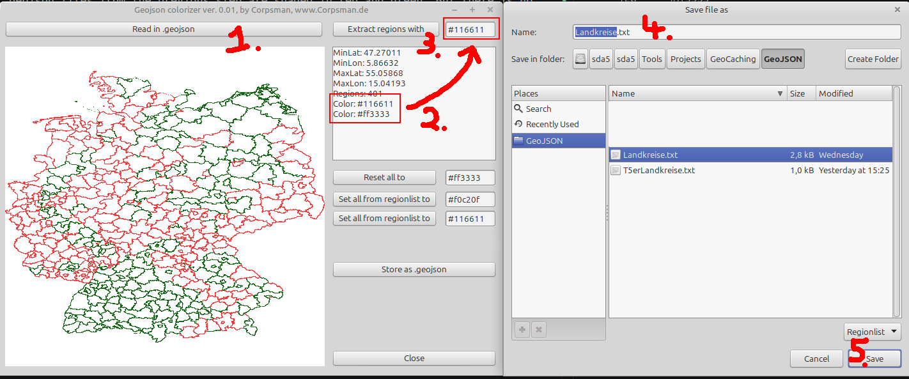
(1) Read in the extracted .geojson file  
(2) Look which colors are available in the file and copy the requested color into the edit field on top right 
(3) Click extract regions with button  
(4) Enter an appropriate filename  
(5) Click save 

#### Colorize the final map

There are actually 3 ways to colorize a loaded .geojson file

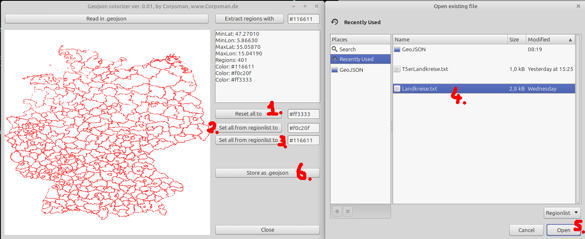

(1) will set all counties to the given color  
(2),(3) Opens a county list dialog to colorize the counties in the list (both buttons do exactly the same; they only have different preset colors)  
(4) (5) select filename and open  
(6) When finished with coloring, save the .geojson file to your hard drive

finished

### Add the .geojson file into c:geo

Loading the .geojson file into c:geo is quite simple:

(1) Copy your final .geojson file onto your smartphone and store it e.g. in the download folder. 

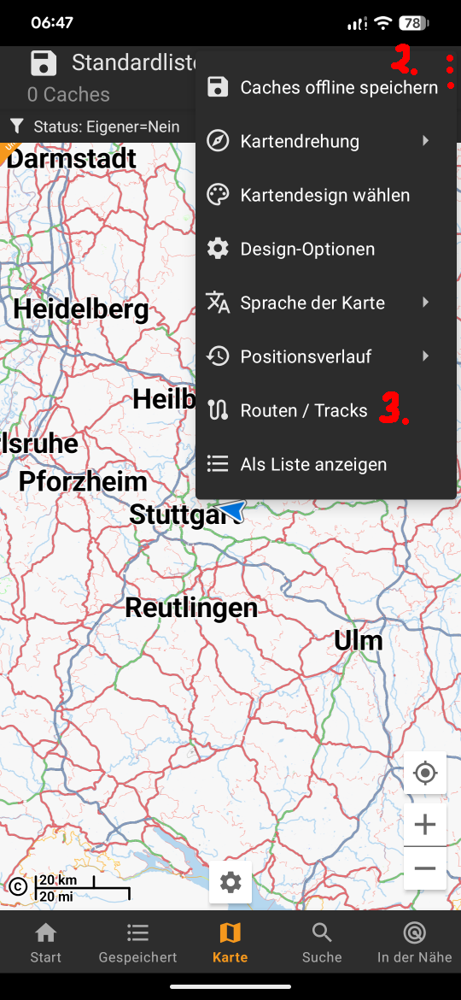

(2) Open the map view in c:geo and click on the ⋮ symbol  
(3) Open the "Routen / Tracks" menu

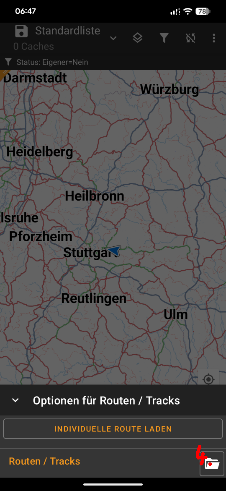

(4) Click to open the file dialog and select your .geojson file

That's it

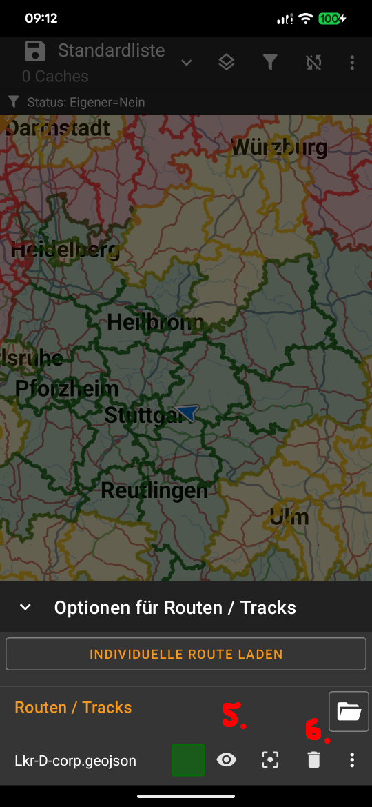

(5) Here you can temporarily disable the overlay 
(6) Here you can remove the overlay

### [Optional] GeoJSON file size reduction

When creating .geojson files with the procedure shown above, the multipolygons are very precise and large in file size (e.g., the Germany map is 40MB in size). While c:geo can handle that, we don't need that precision. I prefer fast loading times instead, so I added the "shrink_geojson.py" script (also created using AI tools). This can shrink the file size of the .geojson files dramatically. When applied to my Germany map, I was able to reduce the file size from 40MB down to 4.4MB without any noticeable decrease in precision.

The usage of the script is quite simple and is shown below: 

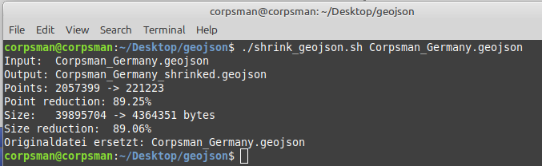