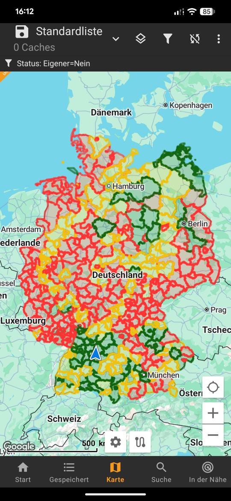

# Project GC County map to c:geo

In this repository i share all needed informations to create a .geojson map overlay that can be used in c:geo.

The final result can for example look like this (in this case, all counties in which i have a found are either yellow or green, and all counties in which i have a T5 cache are green, counties where i have no founds are red):  

## Prerequisites
- User account on [geocaching.com ](https://www.geocaching.com/play/search)
- premium membership on [project-gc](https://project-gc.com/)
- Firefox
- python3 (to download the .geojson files)
- Lazarus IDE (if you want to compile the .geojson editor by yourself)
- c:geo installed on a mobile phone

This tools have been successfully tested and run under Linux Mint Mate.

## Features
- Download arbitrary county maps (filtered using project-gc)
- Colorize county maps in any pattern